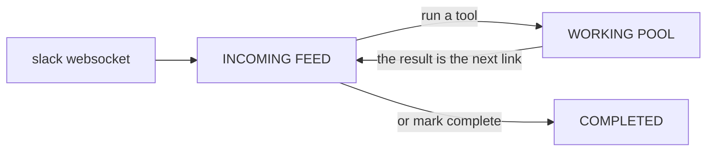

#  workwork 


https://github.com/user-attachments/assets/66968f76-23cf-41b2-ad52-9ad29621802d


A CLI work queue. Connections turn into tasks, tasks get piped through tools, and
whatever the tool produces comes back to the feed as the next link in the chain.



Built on [chalk](https://github.com/chalk/chalk) for the interface and
[`@preact/signals-core`](https://preactjs.com/guide/v10/signals/) for state — the
whole board is a pure function of signals, so anything that mutates the store
repaints the screen.

## Running it

Needs Node 22.18+ (the TypeScript sources run directly via type stripping — no
build step).

```sh
npm install
npm start          # or: node bin/workwork.js
```

Other entry points:

```sh
workwork add "triage the on-call pager noise"   # push a task in from a script
workwork ls                                     # print the board as text
workwork --help
```

## The board

A **1 : 3 : 1** grid — the **incoming feed** on the left, the **detail** of
whatever the cursor is on in the middle, the **working pool** on the right.
Completed tasks are not a column: they live in a flyout that drops out of the
`done` button in the top-left corner.

```
 workwork  ▸ done 2 [3]  ·  5 incoming  ·  1 working
 feeds ● websocket (connected)  ○ manual                                                  1 running
╭─ 1 INCOMING FEED 5 ╮ ╭─ TASK DETAIL ─────────────────────────────────────╮ ╭─ 2 WORKING POOL 1 ╮
│ ▸ dana: prod depl… │ │ dana: prod deploy is stuck on the migration step  │ │ ▸ Fix the flaky … │
│   websocket · 2m   │ │ [incoming] · websocket · 2m ago · 3 steps         │ │   ⠙ claude 12.4s  │
│   review the pric… │ │                                                   │ │                   │
│   manual · 14m     │ │ the rollout has been pending for 20 minutes and   │ │                   │
│                    │ │ the pod is CrashLooping.                          │ │                   │
```

Pressing `3` (or `esc` to close) hangs the completed list over the feed column:

```
╭─ ▾ COMPLETED 2 ────╮ ╭─ TASK DETAIL ─────────────────────────────────────╮
│ ▸ shipped the hot… │ │ shipped the hotfix                                │
│   manual · 4m      │ │ [done] · manual · 4m ago · 5 steps                │
╰────────────────────╯ │                                                   │
```

The middle column is the board's reading surface: title, state, source, chain
depth, the task's whole text, its `meta`, and — while a tool is running — the
live tail of its output, which keeps its slice of the panel even when the text
above has to be trimmed. `⏎` still opens the full chain in the viewer.

Running tools stream their output into the working pane as they go, and raise a
notification (plus a bell) when they finish.

| key | |
| --- | --- |
| `↑ ↓` / `j k` | move within a pane |
| `← →` / `h l` / `tab` | switch pane — incoming ⇄ working (`1` `2` to jump) |
| `3` | open the completed flyout (`esc` closes it) |
| `g` / `G` | top / bottom |
| `n` | new task via the manual feed |
| `⏎` | open the viewer — the task's whole history |
| `space` | add to a multi-selection |
| `r` | run a tool on the task(s) — type to filter the list; `c` is a shortcut for claude |
| `⏎` (in the viewer) | copy the ticked steps — or the one under the cursor — to the clipboard |
| `v` (in the viewer) | split the chain at the cursor — that step onward becomes a new task |
| `d` / `u` | mark complete / send back to the feed |
| `x` | cancel a running tool, or delete a task and its history |
| `f` | data sources — start/stop connections |
| `?` | help |
| `q` | quit (state is saved) |

The viewer is where a task's life is legible: a slack message that got piped to
claude, handed to a herdr tab, then had a `bash` command run against it shows up as four
linked steps with every process transcript intact. Inside it, `↑ ↓` moves
between steps, `space` ticks the ones you want (`a` ticks all), and `⏎` pipes
their text through `pbcopy` — with nothing ticked it copies the step under the
cursor. `v` splits the chain at the cursor: the steps in front of it stay
together as a task that goes back to the incoming feed, and the cursor step
onward is detached into a task of its own — both halves keep their history.

## The task model

A task is an immutable node in a linked chain. Nothing is edited in place —
processing a task appends a **new** task whose `prev` points back at it, and
stamps the old one's `next`. Only the tail of a chain (`next === null`) is live
and shown in a pane; everything behind it is history.

```json
{
  "id": "e2b1…",
  "prev": "5cbd…",
  "next": null,
  "data": "the task text, or a tool's output",
  "created_at": "2026-08-11T02:39:47.206Z",
  "source": "tool:claude",
  "state": "incoming",
  "meta": { "title": "…", "via": "claude", "exit_code": 0 }
}
```

`state` is which pane it sits in, and `meta` is producer-specific detail. The
whole store is JSON at `~/.workwork/state.json`, written atomically (tmp file +
rename) on every change. **If the process dies, nothing is lost** — anything that
was mid-flight in the working pool comes back to the incoming feed on the next
start, tagged with `meta.recovered_at`, because no tool is running for it any
more.

## Adding a data source

A feed converts raw payloads into tasks. It never puts anything on the board
directly: the runtime hands every payload to the feed's own `postprocess`, which
is the only path from raw data to a task.

```ts
// src/feeds/linear.ts
export const linearFeed: Feed = {
  id: 'linear',
  name: 'linear',
  description: 'Issues assigned to me',
  key: 'l',
  autostart: true,

  // required: raw payload -> task draft(s), or null to drop it
  postprocess(raw) {
    const issue = raw as { identifier: string; title: string; url: string };
    return {
      data: `${issue.identifier} ${issue.title}\n${issue.url}`,
      source: 'linear',
      meta: { title: issue.title },
    };
  },

  // optional: open a connection and emit raw payloads
  start(ctx) {
    const poll = setInterval(async () => ctx.emit(await fetchNextIssue()), 30_000);
    return { status: () => 'polling', stop: () => clearInterval(poll) };
  },
};
```

Register it in `src/feeds/index.ts`. Feeds with no `start` are `interactive: true`
— they prompt for input when triggered, which is all the manual feed is.

Shipped: **manual** (type it in) and **websocket** (set `WORKWORK_WS_URL`; the
shape the Slack example takes — it reconnects with backoff and reads common
`text`/`user`/`channel` notification fields).

## Adding a tool

A tool takes task(s) and optional input, and is built from three functions, plus
an optional fourth:

- **`pre`** — adjust the tasks and input before anything runs (template a prompt,
  drop tasks it can't handle, default the input). Task ids must survive so
  results can be chained back.
- **`run`** — do the work. Gets an `AbortSignal` (so `x` can cancel it) and a
  `log()` callback that streams output into the working pane and the viewer live.
- **`post`** — turn the process output into task(s), each linked to the `parent`
  it came from. Returning a result closes that parent out and puts the child back
  in the incoming feed.
- **`cleanup`** — optional. Release whatever `run` left standing once the work is
  finished: `d` on a task walks its whole chain and calls this on the tool behind
  each step, handing back the task *that tool produced* so the meta `post`
  stamped (a tab id, an agent name) says what to let go of. Tools that leave
  nothing behind (claude, bash) leave it off. See [Completing a task](#completing-a-task).

```ts
export const testTool: Tool = {
  id: 'test', name: 'tests', description: 'Run the suite',
  accepts: 'many',
  input: { prompt: 'test filter', placeholder: '' },

  pre: ({ tasks, input }) => ({ tasks, input: input.trim() }),

  run: async ({ input }, ctx) =>
    exec('npm', ['test', '--', input], { signal: ctx.signal, onOutput: ctx.log })
      .then((r) => ({ ok: r.ok, output: r.output, exitCode: r.exitCode })),

  post: ({ tasks }, run) => tasks.map((task) => ({
    parent: task.id,
    data: run.output,
    source: 'tool:test',
    meta: { title: run.ok ? 'tests passed' : 'tests failed', error: !run.ok, worktree: run.meta?.worktree },
  })),

  // Optional: undo whatever the run left on the machine, when the work is done.
  cleanup: (task) => removeWorktree(task.meta.worktree),
};
```

`input` can also be a function of the task(s) under the cursor, for a tool that
asks for different things in different states — herdr agent wants a name for a
new agent and a message for one the task already has.

Register it in `src/tools/index.ts` — that is all a tool needs to be reachable.
`r` lists every registered tool and typing narrows the list to the names holding
what you typed, so no tool carries a shortcut of its own. Shipped tools:

| tool | what it does |
| --- | --- |
| **claude** | a conversation: the message you type becomes a task in the working pool, claude's reply comes back to the feed, and replying again resumes the same claude session |
| **herdr tab** | runs `herdr tab create --label <name>` to open a tab for the task, to work by hand; completing the task closes that tab again |
| **herdr agent** | opens the same tab, runs `herdr agent start <name> --kind <kind> --pane <id>` in it, then submits the task with `herdr agent prompt --wait`, handing the work to an agent instead of a person and holding the working pool until that agent is idle or done — an agent that stops to ask keeps its place in the pool, marked `◆ blocked`, rather than coming back as a result; the pane is then read back with `herdr agent read`, so what the agent said is the task that lands in the feed; run it again on the same task and it talks to that agent rather than starting another; completing the task closes the pane the agent is running in, which ends the agent |
| **bash** | runs a shell command to completion and staples the output onto the task(s); works on a multi-selection |

### Talking to claude

claude runs one process per turn, so a long conversation never holds the board
hostage. Selecting a task and pressing `c` asks for a message — it's required,
because the message *is* the stdin claude works from:

    slack ──▸ [you: take a look] ──▸ [claude: which cluster?] ──▸ [you: staging] ──▸ …
               working pool             incoming feed              working pool

Each reply carries the claude session id in its meta, and the next turn resumes
that session with `--resume`, so claude keeps everything it has already said.
The first turn opens a session with `--session-id` and hands it the chain so far
as context. If a session has gone missing — pruned history, a different working
directory — the run falls back to a fresh session carrying the whole chain
rather than stranding the conversation, and notes `resumed_from` on the result.

The herdr hand-off is a single `herdr tab create --label <name>`. The name is
whatever you type at the prompt; leave it blank and the task's title is used.

`herdr agent` is the same hand-off aimed at an agent. `herdr agent start` never
makes layout of its own — it wants a pane already sitting at a shell prompt — so
it is three calls: the tab (created with `--no-focus`, since nobody needs to be
pulled into it), the agent started in that tab's root pane, read back from the
create response as `.result.root_pane.pane_id`, and finally `herdr agent prompt
<name> <task> --wait`, which submits the task's own text so the agent wakes up
working on the item instead of idling at an empty prompt. The tab keeps the
label you typed; the agent gets a slug of it, because herdr agent names have
to match `[a-z][a-z0-9_-]{0,31}` and be unique among the agents currently alive — a
collision with a live agent picks up a `-2`. The kind is
`WORKWORK_HERDR_AGENT_KIND` (default `claude`). If the agent fails to come up
the tab is left alone rather than closed, so the reason is still on screen in
that pane; the result task carries the agent name and pane id in its meta.

`agent start` wants the pane sitting at an interactive shell prompt, and a tab
created a moment ago is not there yet — a login shell with a real profile behind
it spends a beat sourcing it. herdr says `agent_pane_busy` to that, and says it
immediately: `agent start --timeout` waits for the *agent* to come up, not for
the shell to arrive. So the start is retried for as long as that is the answer,
backing off from 250ms to a second, up to `WORKWORK_HERDR_SHELL_READY_MS`
(default 15s). Only that one error is retried — every other failure is the
answer and comes straight back — and giving up says how long it waited, so a
shell that never arrived doesn't read like a hand-off that never waited. An
agent that comes up but rejects the prompt (herdr refuses submission to a
blocked agent) is reported as a failure that names the agent, since the pane is
still there to be driven by hand.

The submission waits, and that is what keeps the task in the working pool: a
task is `working` for exactly as long as the tool's `run` is pending, so
returning at submission time put the item back in the feed while the agent was
still typing. herdr settles the wait on `idle`/`done` — the turn is over — or
`blocked`, where the agent has stopped at an approval or a question. Cancelling
the run (`x`) only stops the waiting: the agent is a process in its own pane,
and it keeps going with the pane still there to be picked up by hand.

Those two settlements are not the same news, so only one of them ends the run.
A blocked agent has finished nothing: it is paused mid-turn on an answer that
only a person in that pane can give. Coming back at the block put the item in
the incoming feed as a *result*, so a task left the working pool while the work
it names was still half-done, and the way to carry on was to run the tool again
on the result of being interrupted. So a blocked agent keeps its place in the
pool, and its row says what it is doing there:

    ▸ fix the auth bug
      ◆ blocked 1m32s

The marker does not move, because neither does the agent — everything else in
that pool is a spinner. The question it stopped on is read off the pane into the
run's log, so the detail panel shows what it is waiting for without going to the
pane; `1 blocked` is counted apart from `n running` in the status bar. The hold
ends when the agent is genuinely `idle`/`done`, and the result then says it was
held up on the way ("*Its turn is done — it stopped to ask twice on the way.*").

Under it are two `herdr agent wait` calls per block: the first waits for the
agent to *leave* blocked, the second for wherever it settles next — often the
next question, and round it goes. It is two rather than one
`--until idle --until done` so the indicator can go out again when the agent is
moving, and it cannot spin, because `agent wait` matches the state the agent is
in *now* and the leaving wait never asks for the `blocked` it started from.

The whole turn shares one `WORKWORK_HERDR_AGENT_WAIT_MS` budget (default 30
minutes), counted from the submission rather than restarted by each wait inside
it — an agent that stops to ask five times is one turn taking a long time, not
five fresh half-hours. Running that budget out lands exactly the blocked result
that used to land immediately: `status: blocked` in the meta, and a title that
says so rather than looking like an ordinary finish. So does herdr losing the
agent, since a pane someone closed is not going to answer anything.

Then the pane is read back — `herdr agent read <name> --source recent-unwrapped`
— and *that* is the body of the task that goes to the feed. herdr has no
transcript to ask for; the pane is the record. `recent-unwrapped` rather than
`visible` so an answer that scrolled off the top still comes back, and in its
own lines instead of hard-wrapped at the pane's width. The input box at the foot
of the pane — a rule, the line you would type on, another rule, the agent's
status line — is cut off the bottom, since none of it is anything the agent
said, and what is left is bounded by `WORKWORK_HERDR_READ_LINES` (default 200).

That bound is counted back from the box rather than forward from the top of the
read: the answer is what the agent said *last*, and the lines a longer region
reaches back to are the turn before it, so the snapshot ends on the agent's last
word. It is applied here rather than by asking herdr for fewer lines, because
`agent read --lines <n>` is a window on the *viewport* and not on the output —
it counts back from the bottom row of the pane, and the rows under a young
agent's last word are blank. A pane 19 rows into a 58-row viewport answers
`--lines 40` with nothing at all, and `--lines 45` with the last five lines of
the box. So a
finished turn, and the question a blocked agent stopped on, are both readable
off the board without going to the pane at all. A read that fails is not a
failed run: the turn happened either way, the pane is still there, and the task
falls back to what was handed over.

It is `agent prompt --wait` rather than a standalone `herdr agent wait`, because
a separate wait races herdr's detector: the agent is still idle at the instant
the prompt lands, so a wait that subscribes before the turn is classified as
`working` matches that idle and returns immediately. `--wait` only matches
states observed after the submission, and gives up with `agent_prompt_stalled`
if the prompt produced no state change at all.

That agent name in the meta is what makes the tool repeatable. Running it again
on a task that has already been handed off walks back up the chain, finds the
agent, checks with `herdr agent get` that herdr still knows it, and sends
straight into that pane — one call, no second tab. Re-running is a follow-up,
not a fork. The input prompt changes with it: with no agent yet it asks for a
name, and with one it asks for a message, where blank resends the task. So the
tool is both the hand-off and the conversation after it:

    [task] ──a──▸ tab + agent, task submitted ──a "any luck?"──▸ same pane ──a──▸ …

Only if `agent get` says the name is gone — pane closed, herdr restarted — does
a fresh tab and agent get started for the task. What gets sent is the task
itself: since the body is now the agent's reply, each result carries what was
asked on `meta.prompt`, and that — not the reply — is what a blank re-run hands
over again, so the item stays the same thing on every re-run rather than reading
the agent back its own screen. A hand-off that failed records it too, so the
task in the feed is the herdr error but the *item* is still the work — pressing
`a` on it again hands the next agent the job rather than the error message.
(Tasks from a plain `herdr tab` hand-off, which have no prompt recorded, are
still the task minus the note on the front of it.)

### Completing a task

`d` is the end of the work, not just a move to another pane — so it is also
where the chain's leftovers go. A completed task is walked back through its
whole chain, newest step first, and every step is handed to the tool that
produced it (`meta.via`, the stamp `runTool` writes) for that tool's `cleanup`:

    [slack] ─▸ [claude: …] ─▸ [herdr tab "auth bug"] ─▸ [herdr agent auth-bug] ──d──▸ done
               session ended     tab closed              agent's pane closed

The tool is asked to release what *it* opened, using what its own `post` wrote
down. **herdr tab** closes the tab it created (`herdr tab close <id>`).
**herdr agent** closes the *pane* the agent is running in (`herdr pane close
<id>`) — herdr has no "stop the agent", so taking the pane out from under it is
what ends it, and closing the last pane of a tab takes that tab with it, so a
hand-off still sitting in the tab it opened needs nothing more. A tab the user
has since split keeps the panes they added. **claude** terminates the session
the conversation was held in — see below. bash leaves nothing behind, defines no
`cleanup`, and is skipped.

Which pane gets closed is herdr's answer, not the meta's: the agent is looked up
with `herdr agent get <name>` first, because an agent can be moved between panes
and the recorded id would then close the wrong one. Only when the agent is gone
from herdr entirely — it exited but left its pane sitting there — does the pane
the hand-off recorded get closed, and then only if `pane get` says it is still
running the same `terminal_id` the hand-off wrote down. herdr hands pane ids back
out after a close, and a recycled one is somebody else's work.

A claude turn is a process that exits when it has answered, but the conversation
it spoke into is a *session* — `--session-id` on the first turn, `--resume` on
every one after — and that session outlives the process. Completing the chain is
the point the conversation is over, so anything still attached to the session is
shut down: a turn that outlived the wait watching it, or an interactive session
someone resumed the id in to carry on by hand. Which process that is comes from
`claude agents --json`, not from anything the tool wrote down, because pids get
reused and a stale one would terminate somebody else's work. It gets `SIGTERM`,
then `SIGKILL` if it is still there three seconds later. The board's own process
is never a candidate. A session nobody is holding — the usual case — is the
outcome cleanup wanted, so it passes quietly; a listing that fails does not mean
nothing was left behind, so it is reported and the step stays uncleaned. The
transcript on disk is left alone: the conversation ends, not the record of it.

The walk is forgiving by design, because completing a task must not turn into an
error report:

- a tab or pane someone already closed by hand comes back `tab_not_found` /
  `pane_not_found`, which is the outcome that was wanted — it counts as cleaned,
  as does a pane that turned out to be recycled and was deliberately left alone
- a step that does fail is reported in a notice and left **unstamped**, so
  completing the task again retries it; everything else in the chain is still
  cleaned
- cleaned steps are stamped `cleaned_at`, so completing → `u` → completing again
  doesn't shell out twice, and a multi-selection that shares history cleans each
  step once
- it runs behind the "completed" notice — closing tabs takes a moment and the
  board has already moved on — and stays quiet when there was nothing to release

Each cleanup gets `WORKWORK_CLEANUP_TIMEOUT_MS` (default 30s) before its signal
aborts.

## Configuration

| variable | |
| --- | --- |
| `WORKWORK_HOME` | state directory (default `~/.workwork`) |
| `WORKWORK_WS_URL` | websocket feed source; setting it enables the feed |
| `WORKWORK_CLAUDE_BIN` / `WORKWORK_CLAUDE_ARGS` | claude executable and extra `-p` args |
| `WORKWORK_CLAUDE_TIMEOUT_MS` | default 10 minutes |
| `WORKWORK_COPY_BIN` / `WORKWORK_COPY_ARGS` | clipboard command for the viewer (default `pbcopy`) |
| `WORKWORK_BASH_CWD` | directory the bash tool runs in (default: cwd) |
| `WORKWORK_BASH_SHELL` / `WORKWORK_BASH_TIMEOUT_MS` | shell the bash tool uses (default `$SHELL`) and how long a command gets (default 10 minutes) |
| `WORKWORK_HERDR_BIN` | herdr executable (default `herdr`) |
| `WORKWORK_HERDR_AGENT_KIND` | agent kind the herdr agent tool starts (default `claude`) |
| `WORKWORK_HERDR_AGENT_WAIT_MS` | how long a hand-off holds the working pool waiting on the agent's turn (default 30 minutes) |
| `WORKWORK_HERDR_READ_LINES` | how much of the agent's pane is kept when its turn ends, counted back from the foot of the pane (default 200) |
| `WORKWORK_HERDR_SHELL_READY_MS` | how long `agent start` is retried while a new tab's shell is still coming up (default 15s) |
| `WORKWORK_DESKTOP_NOTIFY` | `1` to also raise macOS notifications on completion |
| `WORKWORK_CLEANUP_TIMEOUT_MS` | how long any one tool gets to release what it left behind when a task is completed (default 30s) |

## Layout

```
src/
  core/     task model, signal store, persistence, process runner, exec helpers
  feeds/    data sources: raw payload -> postprocess -> task
  tools/    pre -> run -> post (-> cleanup), one file per tool
  ui/       ansi measuring, theme, key parsing, diffing renderer, panes, overlays
```

`npm run typecheck` runs `tsc --noEmit`.

## How the design boundaries are enforced

Not by convention — by the shape of the code:

- **Everything on the board is a task.** Feeds cannot reach `ingest`. The runtime
  hands every raw payload to that feed's own `postprocess`, which is the only
  path from source data to a task.
- **Tasks are an immutable chain, not mutable records.** Processing appends a
  *new* task with `prev` pointing back; the parent is stamped with `next` and
  stops being live. "Result goes back to the incoming feed" and "keep the whole
  history" are therefore the same mechanism — the viewer just walks the chain.
- **Tools are `pre` → `run` → `post`.** `post` returns results tagged with the
  `parent` they came from; anything a tool declines to produce a result for is
  returned to the incoming feed rather than stranded in the working pool.
- **Whoever opened something is who closes it.** Completing a task walks the
  chain and calls each step's own tool `cleanup`, so the board never needs to
  know what a tool left behind — only which tool left it.
- **The store is JSON on disk at all times**, so a dead process costs nothing.

## Status

Verified end to end, both headlessly and by driving the real binary under a pty:

- the full loop — feed → task → tool → working pool → result back in the feed
- chain integrity: parent stamped with `next`, child linked by `prev`, only the
  tail live, multi-step chains render in the viewer
- cancellation (`x`) tears down the child process and still records a task
- crash recovery (in-flight tasks return to the feed) and corrupt-state handling
- layout geometry at 140/110/84/70/64/50/44 columns, board and flyout alike —
  every row exact width, borders aligned, the grid collapsing feed + detail +
  pool → focused list + detail → one list as the terminal narrows
- `claude` against a stub binary; `bash` against real commands; `add`/`ls`/`--help`
- the `agent_pane_busy` retry, against a stub herdr — 12 checks: a pane busy for
  the first two attempts no longer fails the hand-off, a shell that never
  arrives still fails and says how long it waited, any other start failure comes
  straight back without sitting on it, and re-running a failed hand-off sends
  the work rather than the error it came back with
- the blocked hold, against a stub herdr walking scripted state sequences — 25
  checks: an answered block settles on `idle` without the task ever leaving the
  working pool, two questions in one turn are both held and both counted, the
  row is told `blocked` and told again when the agent moves, the leaving wait
  never asks for `blocked` (so the loop cannot spin), an unanswered block still
  lands the old blocked result with its question read back, a budget spent
  across waits ends the hold instead of starting another, and a turn nobody had
  to answer issues no waits at all
- the herdr agent read-back, against a stub herdr — 22 checks: the pane becomes
  the task on a first hand-off, a blank re-run, a typed follow-up and a turn
  that settles `blocked`; the request stays what a blank re-run resends rather
  than the reply; the input box is trimmed off the bottom of a real 199-line
  pane capture; and a read that fails or comes back empty still lands a task

`tsc --noEmit` is clean.

Two things to know:

- **The websocket feed goes beyond the "manual only" TODO.** It is off unless
  `WORKWORK_WS_URL` is set. It is here because it is step 1 of the Slack example
  and because it exercises the feed interface against a real connection — with
  reconnect and backoff — in a way the manual feed cannot. Delete
  `src/feeds/websocket.ts` and its entry in `src/feeds/index.ts` to drop it.
- **The herdr paths are now driven against a real herdr** (0.8.2): `tab create
  --no-focus` → `agent start --kind claude` → `agent prompt --wait`, the
  follow-up into a live agent, the fall-through that starts a new agent when
  `agent get` says the old one is gone, and a turn that settles on `blocked`
  instead of `done`. The task holds the working pool for the whole turn in each
  case. `agent wait`'s semantics were confirmed against the same herdr — it
  matches the state the agent is in *now*, and answers with the same
  `result.agent.agent_status` shape `statusOf` already reads — but the hold loop
  built on it is covered by the stub, not yet by a live agent stopping to ask.
  `agent read` has been run against a real herdr for its arguments and
  output shape, but the read-back's own end-to-end pass — a real agent's turn
  becoming the task — is covered by the stub, not yet by a live agent.
- **`agent start` used to lose a race with the shell in a tab just created.**
  One run in three came back `agent_pane_busy` ("not an available shell") — the
  tab open, no agent in it, and the hand-off failed inside 40ms. It is now
  retried while that is the answer (see above). Verified against a real herdr
  with a pane deliberately held busy: six real `agent_pane_busy` answers, then
  the agent started on the seventh attempt.
