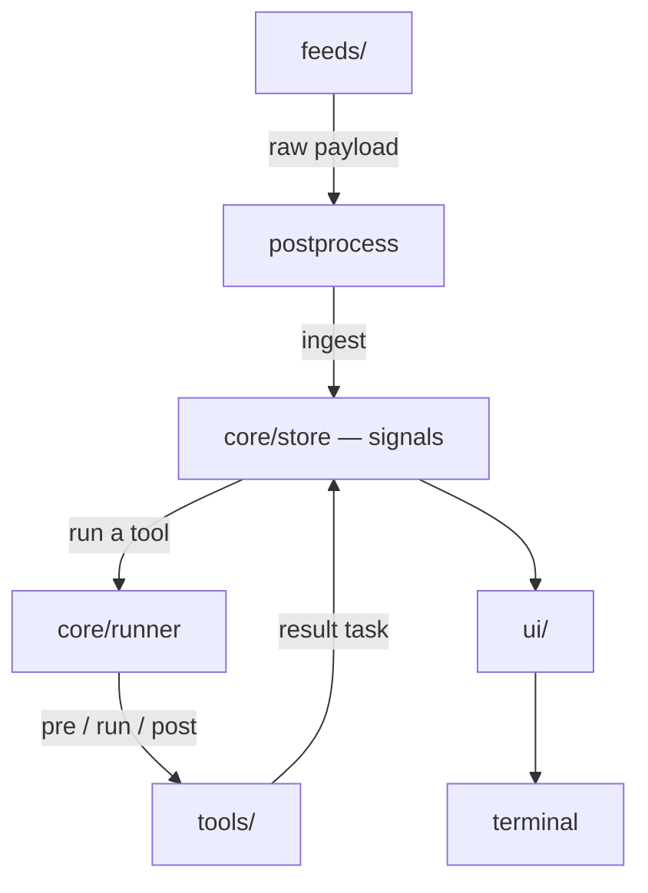
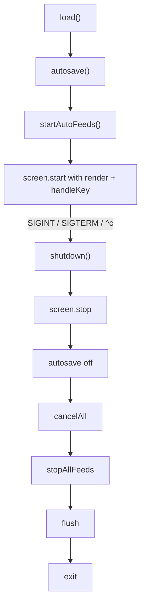

# src/

The whole app, in four directories and one entry point. The split follows the
data path: a **feed** turns a connection into a task, **core** holds that task
and runs it through a **tool**, and **ui** draws whatever core is currently
holding.

| | |
| --- | --- |
| [`index.ts`](index.ts) | the CLI entry point: argument parsing, the `add` / `ls` / `--help` sub-commands, and the interactive boot + shutdown sequence |
| [`core/`](core/README.md) | the task model, the signal store, persistence, the tool lifecycle, and the process helpers everything else runs on |
| [`feeds/`](feeds/README.md) | data sources — the only path from a raw payload to a task on the board |
| [`tools/`](tools/README.md) | what a task can be piped through: `pre` → `run` → `post`, plus an optional `cleanup` |
| [`ui/`](ui/README.md) | the terminal: escape sequences, key parsing, the diffing renderer, the board, and the overlays |

## Which way the imports point

`core/` is the bottom of the stack and `ui/` is the top. Nothing in `core/`
imports from `ui/` or `feeds/`, and nothing in `feeds/` or `tools/` imports from
`ui/` — so the board is replaceable without touching the model, and a tool can
be exercised with no terminal attached at all (which is how the herdr and claude
paths are tested against stub binaries).

There are two deliberate exceptions, both pointing from `core/` into `tools/`:

- `core/runner.ts` imports the **types** in `tools/types.ts`. It has to know the
  shape of a tool to run one; it never knows which tools exist.
- `core/cleanup.ts` imports the **registry** in `tools/index.ts`, because
  completing a task means looking a tool up by the `meta.via` id stamped on a
  task that may have been written days ago. Resolving that id is what the
  registry is for.

## The entry point

`index.ts` is deliberately thin — it wires the pieces together and owns nothing.

Three of the four commands never start the terminal at all: `add` loads state,
pushes one task through the manual feed and flushes to disk; `ls` prints the
board as text; `--help` prints the environment table. Only the bare `workwork`
goes interactive, and it refuses to when stdin is not a TTY rather than drawing
a board nobody can steer.

The interactive path is a startup and shutdown pair:

The order in `shutdown` matters: the screen is torn down **first**, so the alt
buffer is left and the cursor restored before anything that might print or
throw; the flush is last, so the state file on disk reflects tasks that a
cancelled run just put back in the feed. A second `shutdown` is a no-op —
`^c` while the first one is awaiting feeds must not race it to `process.exit`.

`statusPoll` exists because feeds report their connection state lazily: a
websocket that dropped does not push an event saying so, it just is not
connected the next time it is asked. Polling once a second keeps the status bar
honest without the feed interface needing a push channel.
