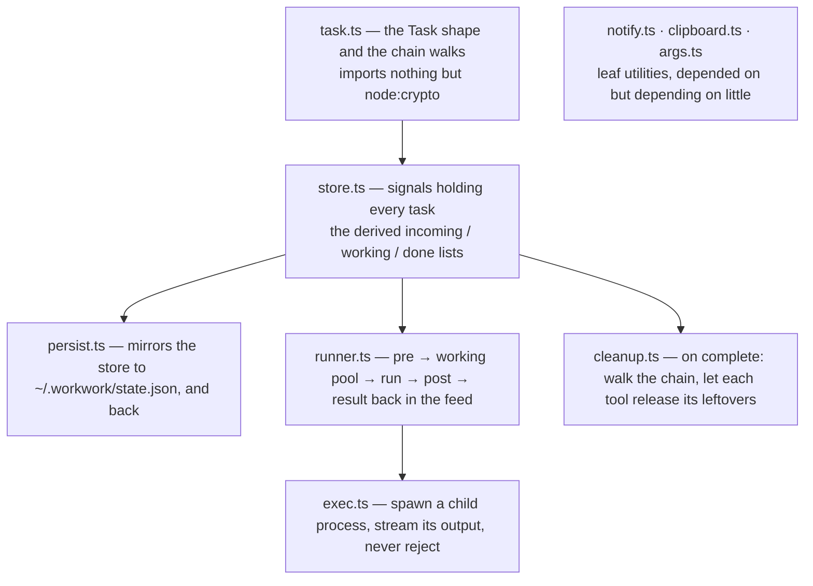
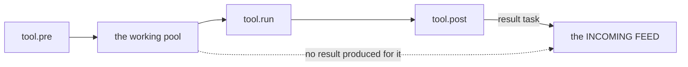

# src/core/

The model and the machinery: what a task *is*, where tasks live, how they get to
disk, and how one gets run through a tool. Nothing here knows there is a
terminal — the board in [`../ui/`](../ui/README.md) is a pure function of the
signals this directory exports.

## How the files stack up

Read `task.ts` and `store.ts` first. Everything else in the directory is a
consumer of those two.

## The files

### `task.ts` — the model

A task is an **immutable node in a linked chain**. Nothing is ever edited in
place: processing a task appends a *new* task whose `prev` points back at it,
and stamps the old one's `next`. Only the tail of a chain (`next === null`) is
live and shown in a pane; everything behind it is history.

Besides the `Task` / `TaskMeta` / `TaskDraft` types, this file holds the walks
the rest of the app reads chains with — `chainOf` (root → tail, and the reason
the viewer can show a slack message becoming a claude run becoming a hand-off),
`rootOf` (what a finished chain is *labelled* by, since the last step is
whatever tool happened to close it), and `taskTitle`.

`nextSeq` is the subtle part: a feed can deliver a burst of messages inside one
millisecond, and `created_at` alone would leave their order to the sort's
tie-breaking. Every task carries a strictly increasing `meta.seq` so the feed
reads in the order things actually arrived.

### `store.ts` — where tasks live

One signal, `tasks`, keyed by id and holding *every* task ever seen — history
nodes included, so a chain can be replayed in the viewer. The three panes are
`computed` views over it: `live` filters to the tails, then `incoming` (newest
first, because a feed reads top-down), `working` (oldest first, so the thing
in flight longest is at the top) and `done` (most recently finished first).

The mutations are the vocabulary of the whole app, and the distinction between
them is the design:

| | |
| --- | --- |
| `ingest` | a brand new task into the feed — what a feed's payload becomes |
| `appendResult` | close a task out by appending its result; **this is what "work happened" means** |
| `setState` | move a live task between panes without touching the chain |
| `stampMeta` | bookkeeping *about* a task that is not itself a step (a `cleaned_at` stamp) |
| `splitChain` | cut a chain in two, both halves keeping their history |
| `discardChain` | drop a task and everything behind it |
| `hydrate` | replace the store wholesale — used only by `persist.ts` at startup |

Every write goes through `put`, which replaces the map rather than mutating it,
because signal subscribers compare by reference.

### `persist.ts` — the store on disk

`load()` at startup, `autosave()` for the lifetime of the process, `flush()`
before exiting. Two behaviours are worth knowing:

- **Recovery.** Anything that was `working` with no `next` when the process died
  comes back as `incoming`, stamped `meta.recovered_at` — no tool is running for
  it any more, so leaving it in the pool would be a lie.
- **Atomic writes.** Every save is a temp file plus a rename, which is atomic on
  the same filesystem, so a crash mid-write cannot leave a half-serialized state
  file. A file that fails to parse is moved aside as `.corrupt-<timestamp>` and
  the app starts empty rather than refusing to start.

`save()` coalesces bursts behind a 250ms timer and chains writes onto a single
promise, so a tool streaming results cannot interleave two writers.

### `runner.ts` — the tool lifecycle

The centre of the app. `runTool` is the whole loop from the design:

It also owns `runs`, the signal of what is in flight — that is what the spinner,
the elapsed time and the live output tail in the working pane are reading. Each
run gets an `AbortController` (so `x` can cancel it), a `log` callback that
appends to a 64KB rolling tail, and a `status` callback for a run that has
stopped and wants a person — a herdr agent that hit an approval. Setting it
swaps the row's spinner for a still marker and that word, so the pool can say
`blocked` about something it is deliberately still holding.

Three failure paths are deliberate rather than incidental: a throwing `pre`
aborts the run with a notice and nothing enters the pool; a throwing `run`
becomes an ordinary failed result; a throwing `post` still produces a task per
input, carrying the error. And any task the tool declined to produce a result
for is put **back in the incoming feed** rather than being stranded in the pool.

`meta.via` — the tool id, stamped on every result here — is what makes
`cleanup.ts` possible later.

### `cleanup.ts` — letting go of what a run left standing

Completing a task finishes the whole piece of work, not just the step under the
cursor, so every step behind it is done with too — and whatever each step left
standing (a herdr tab, an agent holding a pane, a claude session) can go.

`cleanupChains` walks each chain newest step first and asks the tool named by
that step's `meta.via` to clean up after itself. The rules that make it safe to
run repeatedly:

- steps that succeed are stamped `cleaned_at`, so complete → reopen → complete
  does not shell out twice
- a tool that throws is **recorded and skipped**, not stamped — one tab that
  would not close must not strand the rest of the chain, and completing again
  retries it
- chains are de-duplicated across the whole selection
- each tool gets `WORKWORK_CLEANUP_TIMEOUT_MS` (default 30s) before its signal
  aborts

`cleanupChain` (singular) is the one-task convenience wrapper; the UI currently
calls `cleanupChains` directly.

### `exec.ts` — running things

Every tool that shells out goes through here. Its contract is that it **never
rejects**: a command that cannot even be spawned comes back as `ok: false`, so
a tool can turn it into a task like any other output.

`ExecResult` splits `output` (stdout and stderr interleaved, the way a terminal
would show it — what the log pane wants) from `stdout` alone (what a tool should
treat as the answer, so a process that chats on stderr does not put its warnings
in the resulting task). Cancellation and timeout both send `SIGTERM` and
escalate to `SIGKILL` after two seconds.

`spawnDetached` is the fire-and-forget variant, for a process that should
outlive the run that started it.

### `notify.ts` — the notice line

A signal holding the last three notices, each expiring after 8s. `bell: true`
writes `\x07`; `WORKWORK_DESKTOP_NOTIFY=1` also raises a macOS notification via
`osascript`. Deliberately not a UI concern — a tool finishing at 3am should be
able to say so whether or not the board is the focused window.

### `clipboard.ts` — `pbcopy` as a promise

What `⏎` in the viewer copies with. Wraps `exec`, so a missing binary is a
notice rather than a crash. `WORKWORK_COPY_BIN` / `WORKWORK_COPY_ARGS` swap the
command out on a non-mac machine.

### `args.ts` — string ↔ argv

`splitArgs` turns a typed command string into argv honouring quotes and escapes
— what lets the claude tool fold `WORKWORK_CLAUDE_ARGS` into its argv from a one-line
prompt, and what parses `WORKWORK_CLAUDE_ARGS`. `shellQuote` is its inverse and
is currently unused; it is here for a tool that needs to build a command line
for a shell rather than for `spawn`.
