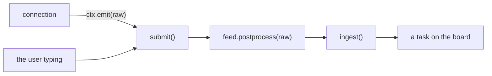
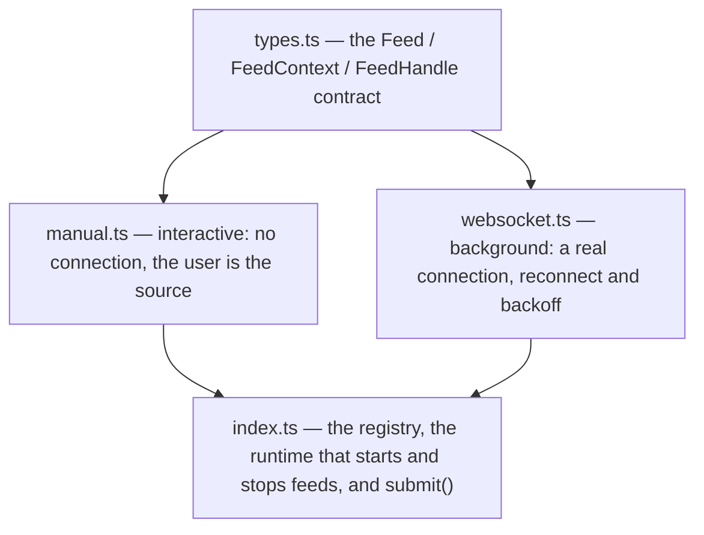

# src/feeds/

Data sources. A feed's job is to turn whatever arrives from the outside world
into a task — and it is the *only* way anything gets onto the board.

That is enforced by shape, not convention: a feed has no access to `ingest`. It
either returns drafts from `postprocess`, or hands a raw payload to `ctx.emit`,
which the runtime passes straight back through that same feed's `postprocess`.
There is exactly one path from raw data to a task.

## The files

### `types.ts` — the contract

Three types. `Feed` is what you implement; `FeedContext` is what a running feed
is handed (`emit`, `report`, `signal`); `FeedHandle` is what it gives back
(`status()` for the status bar, `stop()` for shutdown).

The split that matters is `postprocess` versus `start`:

- **`postprocess` is required.** Raw payload in, `TaskDraft` (or an array, or
  `null` to drop it) out. This is the boundary the whole directory exists to
  enforce.
- **`start` is optional.** A feed with one opens a background connection and
  emits into it. A feed without one is `interactive: true` — it has nothing
  running, and produces a payload when the user asks for it.

`autostart` decides whether a background feed connects when the app boots.

### `index.ts` — the registry and the runtime

`feeds` is the array — adding a source means adding it here and nothing else.

`submit(feed, raw)` is the single conversion path described above, and the one
place a throwing `postprocess` is caught and turned into a notice. It is called
from three directions: `ctx.emit` on a background feed, the prompt on an
interactive one, and `workwork add` from the command line.

The rest is connection lifecycle. `feedStates` is a signal of
`{ running, status, received }` per feed, which is what the status bar draws.
`startFeed` / `stopFeed` / `toggleFeed` manage an `AbortController` and the
`FeedHandle` alongside each other, so a feed can be stopped either by having its
`stop()` called or by watching `ctx.signal` — whichever suits the connection.

`pollFeedStatus` exists because status is **pulled, not pushed**: a socket that
dropped does not announce it, so `index.ts` re-reads `handle.status()` on a
timer (driven from `../index.ts`) and patches the signal when it has changed.
That keeps the `FeedHandle` interface down to two functions.

### `manual.ts` — the user as a data source

The simplest possible feed: whatever gets typed. It has no `start`, so it is
`interactive`, and `prompt` is the label the input box shows.

It is worth reading precisely because it is trivial — it still goes through
`postprocess` like everything else, which is the point. Its only real work is
turning a literal `\n` into a newline, so a one-line prompt can still produce
multi-line task data.

This is also the feed `workwork add "…"` and the `n` key both push through.

### `websocket.ts` — a real connection

The generic background feed, and the shape the Slack example in the root README
takes. Point `WORKWORK_WS_URL` at any socket streaming JSON or plain text and
each message becomes a task. `autostart` is `Boolean(URL_ENV)`, so nothing dials
out unless it has been configured.

Two halves worth reading separately:

- **`postprocess`** tries a best-effort read of a common notification shape
  without committing to one: a message from `text` / `message` / `body` /
  `title` / `summary`, an author from `user` / `username` / `author` / `from` /
  `channel`. What it finds becomes the title; the full JSON is appended below a
  rule so nothing is lost. Anything that is not JSON is used as-is.
- **`start`** is the reconnect loop — exponential backoff capped at 30s, a
  `stopped` flag so a deliberate close does not schedule a retry, and a `state`
  string (`connecting` / `connected` / `reconnecting (#n)` / `disconnected`)
  that `status()` hands back to the status bar.

## Adding a feed

Write the file, export a `Feed`, add it to the `feeds` array in `index.ts`.
There is no registration step beyond that — the picker (`f`) lists whatever is
in the array, and `key` is the shortcut it gets. See the root
[README](../../README.md#adding-a-data-source) for a worked example.
