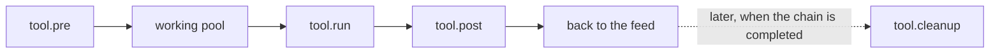
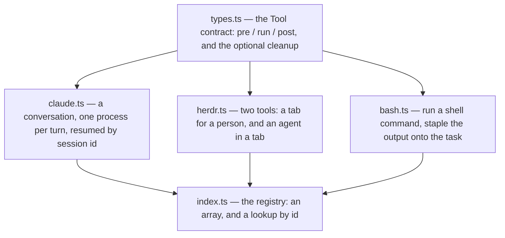
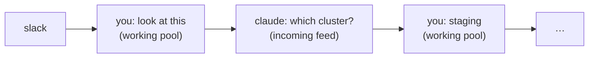
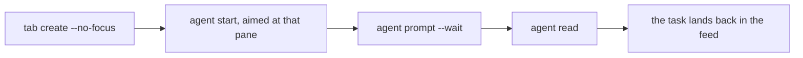

# src/tools/

What a task can be piped through. A tool takes task(s) plus optional typed
input, does something with them, and returns task(s) — which go back to the
incoming feed as the next link in the chain.

The lifecycle itself lives in [`../core/runner.ts`](../core/runner.ts) — this
directory is the contract and the implementations.

## The files

`index.ts` is ten lines and does two jobs: `tools` is what the `r` picker lists,
and `toolById` is how `core/cleanup.ts` resolves a `meta.via` id stamped on a
task that may have been written days ago.

## `types.ts` — the four functions

- **`pre`** adjusts the tasks and input before anything runs. Whatever it
  returns is what enters the working pool and what `post` chains onto, so the
  tasks must exist in the store — either the ones handed in, or a new link the
  tool opened on top of one. (The claude tool does exactly that: the message you
  type becomes a task of its own, and *that* is what sits in the pool.)
- **`run`** does the work. It gets an `AbortSignal` — so `x` cancels it — and a
  `log()` callback that streams into the working pane and the viewer live.
- **`post`** turns the output into results, each tagged with the `parent` it
  came from. Returning a result closes that parent out; anything a tool declines
  to produce a result for goes back to the feed untouched.
- **`cleanup`** is optional, and is called much later: when the chain a task
  belongs to is **completed**. It is handed the task *that tool produced*, so
  whatever `post` stamped on the meta (a tab id, an agent name, a session id) is
  what identifies the thing to release. It must be idempotent and forgiving —
  the resource is usually already gone by hand — and should throw only when
  something was genuinely left behind. Tools that leave nothing standing omit it.

`input` describes what to ask the user for, and can be a **function of the tasks
under the cursor** for a tool whose question changes with the state — herdr
agent asks for a name when there is no agent yet, and for a message when there
is one.

## `claude.ts` — a conversation, not a one-shot

One process per turn, so a long conversation never holds the board hostage. The
turn structure is the whole design:

`pre` appends the typed message as a task in the `working` state — the link that
sits in the pool is the thing being answered, not the task you selected. `run`
walks back up the chain for a `meta.claude_session` and resumes it with
`--resume`; a chain with none opens a fresh one with `--session-id` and hands it
the whole chain as an opening prompt. A session that has gone missing (pruned
history, a different working directory) falls back to a fresh session carrying
the chain rather than stranding the conversation, and records `resumed_from`.

`shape` is where the stdout/stderr split from `exec` earns its keep: a
successful answer is **stdout alone**, because claude's stderr warnings would
otherwise become the body and the title of the task in the feed. A failed run
keeps the whole transcript, since the reason is usually on stderr.

`cleanup` ends the *session*, which outlives each process that spoke into it.
Which process is holding it comes from `claude agents --json` rather than from
anything this tool wrote down, because pids get reused and a stale one would
terminate somebody else's work — and the board's own pid is explicitly excluded,
since workwork can be running inside a claude session. `SIGTERM`, then `SIGKILL`
after a three-second grace period. A listing that *fails* throws, because not
knowing what is attached is not the same as knowing nothing is.

Note that `delay()` here is deliberately **not** `unref`'d, unlike the timers
guarding a run: cleanup is waiting on it, and a timer the event loop may ignore
would let the process exit with the session half-terminated.

## `herdr.ts` — hand the work to somebody else

Two exported tools sharing one file, because they share their entire vocabulary
of herdr calls, id parsing and pane bookkeeping.

**`herdrTool`** (`herdr tab`) is the hand-off to a person: one
`herdr tab create --label <name>`. The tab id is read back off the creation so
`cleanup` has something concrete to close.

**`herdrAgentTool`** (`herdr agent`) is the same hand-off aimed at an agent, and
is the most involved code in the repo. A first hand-off is three calls, because
`herdr agent start` makes no layout of its own — it wants a pane already sitting
at a shell prompt:

Four decisions in there are worth knowing before editing it:

- **Re-running is a follow-up, not a fork.** `agentOf` walks back up the chain
  for an agent name; if herdr still knows it, the run is a single `agent prompt`
  into that pane. A second pane doing the same work is never what was wanted.
- **The wait is what holds the working pool.** A task is `working` for exactly
  as long as `run` is pending, so returning at submission time would put it back
  in the feed while the agent was still typing. `--wait` (rather than a separate
  `agent wait`, which races the detector) settles on `idle`/`done` or `blocked`.
- **The pane is the transcript.** herdr has none to ask for, so `readBack` takes
  a snapshot and `tidySnapshot` trims the input box off the foot of it, keeping
  the last `WORKWORK_HERDR_READ_LINES` — counted back from the box, because the
  answer is what the agent said *last*.
- **`startAgent` retries.** A tab created a moment ago is not at a shell prompt
  yet, and herdr answers that with `agent_pane_busy` immediately. Only that one
  error is retried, backing off up to `WORKWORK_HERDR_SHELL_READY_MS`.

`cleanup` closes the pane the agent is running in, since herdr has no "stop the
agent". It asks herdr where the agent is *now* rather than trusting the recorded
pane id — an agent can be moved — and falls back to the recorded pane only if
`pane get` confirms it is still the same `terminal_id`, because pane ids get
handed back out after a close.

The `paneIdOf` / `tabIdOf` / `terminalIdOf` / `statusOf` helpers all share one
shape: parse the JSON, and fall back to a regex over the raw payload. A change
in herdr's output shape then costs a worse guess rather than a failed run.

## `bash.ts` — the simple one

Read this first if you are writing a tool. It is the whole contract in one
short file: `pre` trims what you typed, `run` hands it to a shell through
`exec` and waits for the process to finish, `post` staples the transcript onto
every task handed in. One process, one result per task, so a batch submitted
together all pick up the same output.

The command goes to `$SHELL -c <command>` **as one string**, not as argv — that
is what keeps pipes, redirects, `&&` and globs working the way they do when you
type them, and it is why this tool has no use for `splitArgs`. The input is
`required`: there is no sensible default command to fall back to.

It defines no `cleanup` — it leaves nothing on the machine — which is what a
tool that has nothing to release should look like. The working directory comes
from the task's own `meta.cwd` if a feed or an earlier run in the chain set one,
then `WORKWORK_BASH_CWD`, then the process cwd. A command is killed after
`WORKWORK_BASH_TIMEOUT_MS` (10 minutes), and `x` cancels it through the
`AbortSignal` — either way the partial transcript still becomes a task.

The resulting task's title is the command's first line, truncated, with the
exit code appended when it failed; the full command survives as the `$ …`
header on the task body and on `meta.command`.

## Adding a tool

Write the file, export a `Tool`, add it to the array in `index.ts`. That is all
— `r` lists every registered tool and typing narrows the list, so no tool needs
a shortcut of its own. See the root
[README](../../README.md#adding-a-tool) for a worked example.
