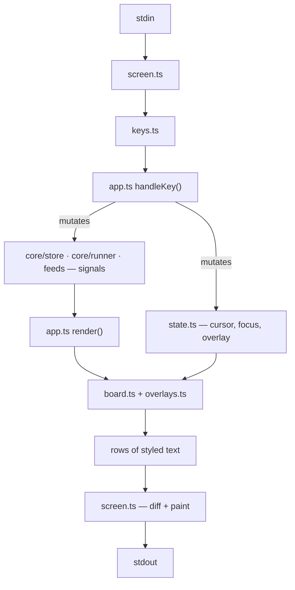
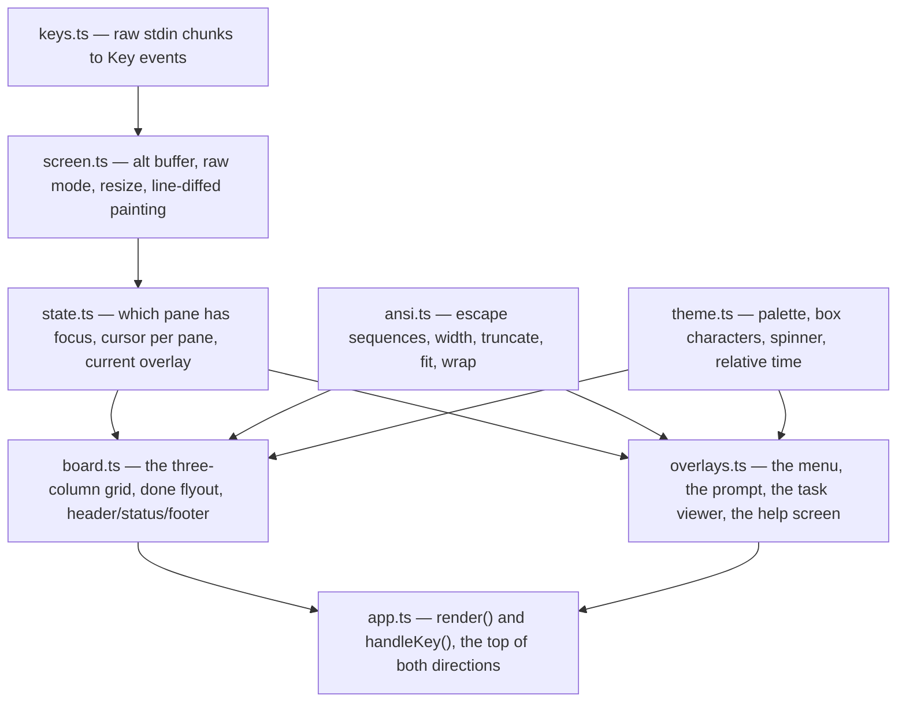

# src/ui/

The terminal. Everything here is downstream of the signals in
[`../core/`](../core/README.md) — the board is a **pure function of state**, so
anything that mutates the store repaints the screen and no view code ever asks
for a redraw.

## The files

The bottom three (`ansi`, `theme`, `keys`) know nothing about the board — at
most a type name (`theme.ts` imports `TaskState` to key its colour table). They
can be read and changed on their own. `app.ts` is the only file that works in
both directions: it composes the frame and it owns every action a key can
trigger.

## The files, in the order worth reading

### `ansi.ts` — measuring text that lies about its length

The foundation the whole layout rests on. A styled string's `.length` has
nothing to do with the columns it occupies, so every width calculation in the
directory goes through `width()`, which strips escape sequences and then counts
**display columns** — zero for combining marks, joiners and variation selectors,
two for CJK and emoji ranges.

`truncate` cuts to a column budget without slicing an escape sequence in half,
and closes any styling still open at the cut with a reset. `fit` is the workhorse
— truncate if long, pad if short, so a row is *exactly* the column width and the
grid cannot be shoved sideways by one wide character. `wrap` hard-wraps plain
text for the detail panel and the viewer, chopping any single token wider than
the pane.

### `theme.ts` — what things look like

The palette (chalk degrades hex to the nearest supported colour on its own), the
per-state colours and labels, the box-drawing characters, the spinner frames,
and two formatters: `ago` for compact relative time (a feed reads better with
`3m` than a timestamp) and `duration` for elapsed run time.

`stateLabel` and `stateShort` are a pair — `board.ts` drops to the short label
rather than letting a pane title get chopped mid-word.

### `keys.ts` — stdin as key events

`parseKeys` turns a raw chunk into `Key[]`, handling what a terminal actually
sends: CSI sequences with modifier parameters, SS3 (some terminals in
application cursor mode), `ESC`+char meta chords, control characters, and
printable text taken a whole code point at a time so emoji and pastes survive.

It returns an array rather than one key because a paste arrives as a single
chunk of many keystrokes. `isPrintable` is what the prompt and the menu filter
use to decide whether a key is literal text.

### `screen.ts` — the render loop

Owns the terminal: alt buffer, hidden cursor, raw mode, resize handling, and the
120ms `tick` signal that keeps spinners and relative timestamps alive.

Two things make it feel steady:

- **Line diffing.** `paint` rewrites only the rows that actually changed. A
  full-screen rewrite flickers; diffing keeps the board still even while a tool
  streams output into it. A resize clears `previous` to force a full repaint.
- **Coalesced frames.** The render `effect` re-runs on every signal change, but
  painting is deferred by 16ms and always paints the *newest* frame, so a burst
  of tool output becomes one paint rather than hundreds.

`start()` takes `render` and `onKey` as options — it never imports `app.ts`, so
the dependency points one way.

### `state.ts` — view state

The board's own state, separate from the task store: which pane has focus, the
cursor index per pane, and the current `Overlay`.

Two modelling decisions carry a lot:

- **`done` is not a board column.** `BOARD_PANES` is `['incoming', 'working']`,
  and focusing `done` is what opens the completed flyout — so "is the flyout
  open" and "where is focus" are one fact rather than two that can disagree.
  `lastBoardPane` is what focus falls back to when it closes.
- **`Overlay` is a discriminated union** of `help` / `viewer` / `menu` /
  `prompt`, so exactly one can be up and each carries only its own state. On a
  menu, a `filter` that is *present but empty* means "this is a menu you search"
  as opposed to one you pick by shortcut key.

`cursorFor` clamps on read rather than on write, because the list under the
cursor can shrink at any moment — a feed pushing a task in, a run finishing.

### `board.ts` — the grid

`boardColumns` is the responsive layout: a 1 : 3 : 1 grid of feed, detail and
pool, degrading to focused-list + detail, then to two lists when the window is
short but wide, then to a single column. It drops the *far column first* and the
detail second, rather than squeezing three unreadable strips.

Below that, one function per region — `renderList`, `renderFlyout`,
`renderDetail`, `renderRow`, plus `headerLine` / `statusLine` / `noticeLine` /
`footerLine`, which `app.ts` composes into the frame.

Details worth knowing before editing:

- **The detail panel budgets live output first.** When a tool is running, its
  output tail is reserved a slice of the panel *before* the static text above is
  trimmed to fit — the newest output being visible is the whole point.
- **The flyout covers its column outright.** A half-hidden box underneath reads
  as a rendering bug, and the feed's count is still in the header.
- **Completed rows are labelled by `rootOf`**, not by the task itself: a
  finished chain is read by what came in, since the last step is whatever tool
  happened to close it.
- `boxHeader` truncates the title rather than letting the border run past the
  column, which would shove the whole grid sideways.

`listFor` here is a local duplicate of the helpers in `state.ts` / `store.ts`;
`ruleLine` is exported but currently unused.

### `overlays.ts` — everything that sits on top

`renderPanel` draws the bottom-anchored panels (`menu`, `prompt`) — they replace
whole rows, so nothing needs compositing — and `panelHeight` reports how tall one
will be. `renderHelp` is the static key reference.

`renderViewer` is the substantial one. It renders a whole chain, root to tail,
and returns `{ lines, total, steps }` — where `steps` are `StepAnchor`s marking
where each step starts and ends in the rendered content. That is what lets
`app.ts` scroll by *step* rather than by line: it asks the renderer for the
anchors, then computes the scroll that brings a step into view. The renderer
stays the single source of truth about the layout, and scrolling can never run
past the end of the content.

### `app.ts` — the top of both directions

`render()` composes the frame; `handleKey()` dispatches input. Everything the
board can *do* is a function in the middle of the file — `newTask`, `startTool`,
`openTools`, `openFeeds`, `completeTask`, `reopenTask`, `cancelOrDelete`,
`openViewer`, `copyViewerStep`, `splitViewerChain`.

Input dispatch is by overlay: a prompt, menu or viewer that is up consumes the
key, and only a bare board reaches `handleBoard`. `^c` is checked before all of
it.

Two subtleties that are easy to reintroduce as bugs:

- **Targets are captured, not re-read.** `startTool` and `openTools` take the
  task list as an argument, captured at the moment the user chose. A feed can
  push a task into the pane while the picker or the input prompt is open, which
  reorders `incoming` under the cursor — re-reading it at launch time would run
  the tool on the wrong task. The same applies to `r` inside the viewer, which
  runs on the task being *read*.
- **`tidyUp` runs behind the notice.** Completing a task reports success
  immediately and lets the chain cleanup finish in the background — closing tabs
  takes a moment and the board has already moved on. Only the outcome is
  reported, and only when there was something to release.

`setQuitHandler` is how `../index.ts` injects the shutdown sequence without this
file importing it.
